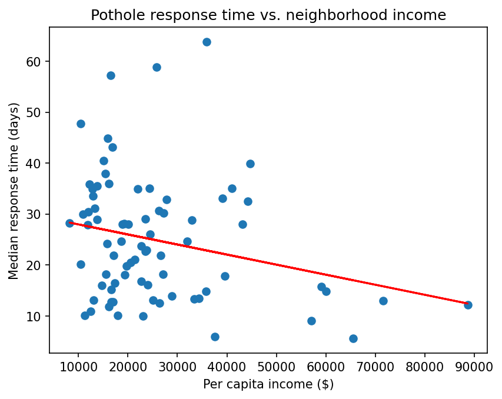
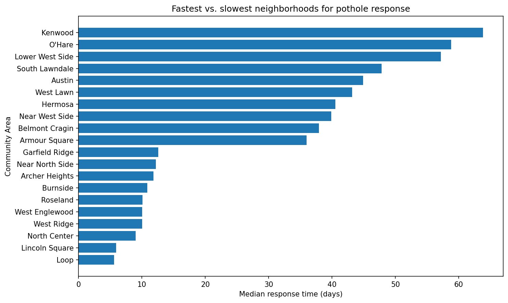

# Chicago 311 Pothole Response Times
 
**Do pothole repair times in Chicago vary with neighborhood income? An observational analysis of 76k 311 requests.**
 
Across Chicago's 77 community areas, lower-income neighborhoods show modestly longer pothole repair times. The pattern is statistically significant and persists after controlling for request volume so it isn't just a backlog effect  but it's weak: income accounts for only about 9% of the variation. This is an observed association, not evidence of causation; unmeasured factors like road condition and pothole severity likely matter more. I framed the project around separating differences in neighborhood conditions from differences in measured response times — a methodological question, not a policy claim.
 
**Tools:** Python (pandas, scikit-learn, statsmodels, geopandas, libpysal/esda), matplotlib.
 
## Data
 
- **311 pothole requests** (Chicago Data Portal): ~76k, 2020–2025, filtered to "Pothole in Street."
- **Socioeconomic indicators by community area** (Chicago Data Portal, 2008–2012): per-capita income and hardship index, joined on community-area number.
- **Community-area boundaries** (Chicago Data Portal, GeoJSON): the geographic shape of each of the 77 community areas, used to determine which areas border each other for the spatial analysis.
Income data predates the pothole data by ~a decade, so it serves as a proxy for relative neighborhood wealth; areas that changed substantially may be misclassified.
 
## Method
 
1. Response time = closed − created date, per request.
2. Aggregated to one row per community area, using the median (the distribution is right-skewed).
3. Tested the most obvious alternative explanation first: request volume (busier areas may build backlogs).
4. Regressed response time on income + volume together, isolating income's association with volume held constant.
5. Robustness check: re-ran using the hardship index instead of income — same direction.
6. Statistical inference: refit the income + volume regression in `statsmodels` (OLS) to obtain p-values and confidence intervals, testing whether the income effect is statistically significant rather than just present. Standardized the predictors so the two coefficients are directly comparable.
7. Spatial autocorrelation: built a neighbor map from the community-area boundaries and computed Moran's I to test whether response times cluster geographically — i.e., whether nearby areas have similar wait times, which would violate the independence assumption of the regression.

## Findings
 
The raw spread is large — the slowest community area (Kenwood, ~64 days) shows repair times roughly 13x longer than the fastest (the Loop, ~5 days).
 
Volume doesn't account for most of it: request volume correlates only weakly with response time (~0.33, ~11% of the variation). Income shows a negative association with response time (−0.25) that persists after controlling for volume. Fitting the regression with statistical inference, the income effect is significant (p = 0.022) and its confidence interval excludes zero, while volume is not significant (p = 0.124). After standardizing both predictors to the same scale, income's effect is larger in magnitude than volume's — so of the two measured factors, income is the stronger one.
 
That said, the effect is small: the model explains only ~9% of the variation. Income is a statistically real but minor factor; most of the variation is associated with something else.
 
## Robustness & Statistical Checks
 
- **Significance:** the income association is statistically significant (p = 0.022); volume is not (p = 0.124) once income is included. So the income effect is unlikely to be an artifact of the small (77-area) sample.
- **Measure of disadvantage:** re-running with a composite hardship index instead of per-capita income gives the same direction, so the finding doesn't depend on how disadvantage is measured.
- **Spatial autocorrelation:** I tested whether nearby community areas have similar response times (Moran's I = 0.30, p = 0.001). They do — response times cluster geographically, so the areas are not statistically independent. This means the regression's standard errors are likely slightly optimistic; the income association still holds, but its precision should be read with that caveat. A spatial regression model would be the proper next step.

## Why the Simple Story Doesn't Hold
 
The extremes don't fit a clean "lower-income = slower" pattern: Kenwood (slow) is mixed-to-affluent, O'Hare (slow) is an airport rather than a residential area, and some lower-income areas like West Englewood and Roseland are among the fastest. This is consistent with income accounting for so little of the variation — at the neighborhood level, unmeasured factors like land use and road infrastructure appear more relevant than wealth.
 
## Charts
 

 
*Income vs. median response time, one point per community area. The downward trend line shows the association; the loose scatter shows how much it leaves unexplained.*
 

 
*The 10 fastest and 10 slowest community areas — the ~13x spread.*
 
## Limitations & Next Steps
 
- **Duplicates:** repeated reports of one pothole appear as separate rows; not deduplicated, which may affect volume counts.
- **Open requests:** ~2k requests had no close date and are excluded, which may shift response-time estimates.
- **Income vintage & outliers:** 2008–2012 income figures; non-residential areas like O'Hare aren't directly comparable to neighborhoods.
- **Spatial dependence:** response times cluster geographically (see above), so a non-spatial regression slightly overstates precision.
**Next steps (analysis):** deduplicate repeated reports, incorporate current income data, add road-infrastructure variables, and fit a spatial regression model to account for geographic clustering.
