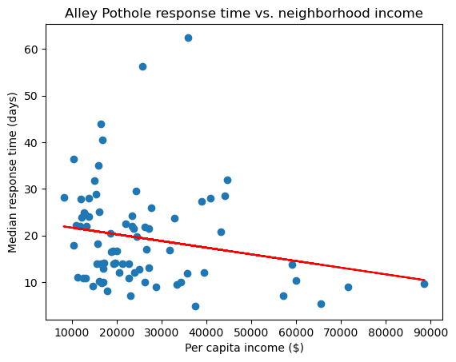
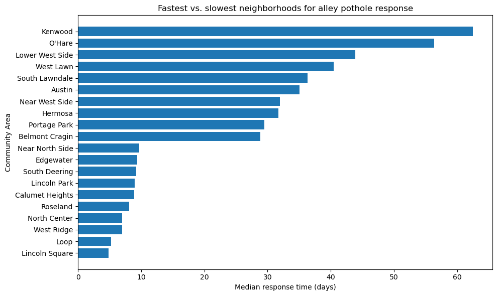

# Chicago 311 Alley Pothole Response Times
 
Do alley pothole repair times in Chicago vary with neighborhood income? An observational analysis of ~54k de-duplicated 311 requests.
 
After removing duplicate reports, lower-income neighborhoods still show slightly longer alley pothole repair times, but the association is not statistically significant (p = 0.075), and income and request volume together explain only about 4% of the variation. Response times do cluster geographically (Moran's I = 0.28, p = 0.002). An earlier version of this analysis, run before de-duplication, found a significant income effect (p = 0.022); that result did not survive removing duplicate reports. I framed the project around separating differences in neighborhood conditions from differences in measured response times — a methodological question, not a policy claim.
 
Tools: Python (pandas, scikit-learn, statsmodels, geopandas, libpysal/esda), matplotlib, Tableau.
 
## Data
 
- **311 alley pothole requests** (Chicago Data Portal, `Alley Pothole Complaint`, short code `PHB`): 76,717 requests created 2020–2025; 53,878 after removing duplicate reports.
- **Socioeconomic indicators by community area** (Chicago Data Portal, 2008–2012): per-capita income and hardship index, joined on community-area number.
- **Community-area boundaries** (Chicago Data Portal, GeoJSON): the shape of each of the 77 community areas, used to determine which areas border each other for the spatial analysis.
Income data predates the pothole data by about a decade, so it serves as a proxy for relative neighborhood wealth; areas that changed substantially may be misclassified.
 
## Method
 
1. **Removed duplicate reports** (`DUPLICATE = True`): 22,839 rows, about 30% of the data. A duplicate's close date follows its parent request, so keeping duplicates distorts both response times and request volume.
2. **Response time** = closed − created date, per request.
3. **Aggregated** to one row per community area, using the median (the distribution is right-skewed).
4. **Tested the most obvious alternative explanation first:** request volume (busier areas may build backlogs).
5. **Regressed** response time on income + volume together, isolating income's association with volume held constant.
6. **Robustness check:** re-ran using the hardship index instead of income.
7. **Statistical inference:** refit the income + volume regression in statsmodels (OLS) to obtain p-values and confidence intervals. Standardized the predictors so the two coefficients are directly comparable.
8. **Spatial autocorrelation:** built a neighbor map from the community-area boundaries and computed Moran's I to test whether response times cluster geographically, which would violate the regression's independence assumption.
## Findings
 
The raw spread is large: the slowest community area (Kenwood, ~62 days median) takes roughly 13x longer than the fastest (Lincoln Square, ~5 days).
 
Request volume doesn't explain it. Volume correlates only weakly with response time (~0.19, about 4% of the variation). Income shows a negative association (−0.20), meaning lower-income areas tend to wait somewhat longer. But in a regression that controls for volume, the income effect is not statistically significant (p = 0.075; the 95% confidence interval includes zero), and volume isn't significant either (p = 0.758). Together they explain about 4% of the variation. Because response times cluster geographically (Moran's I = 0.28, p = 0.002), the regression's standard errors are likely optimistic, so the real uncertainty is even larger.
 
The data therefore doesn't support a reliable income effect. Most of the variation in alley pothole response times is associated with factors not measured here, such as land use, infrastructure, and alley condition.
 
## Robustness & Statistical Checks
 
- **De-duplication:** the original (duplicate-inclusive) analysis found a significant income effect (p = 0.022, R² ≈ 0.09). After removing duplicates, it weakened to p = 0.075 and R² ≈ 0.04. The finding is sensitive to this data-quality step, which is why it is reported as not significant.
- **Measure of disadvantage:** re-running with the composite hardship index instead of per-capita income gives the same direction (more disadvantaged areas slightly slower), with even less explanatory power (R² ≈ 0.03).
- **Spatial autocorrelation:** response times cluster geographically (Moran's I = 0.28, p = 0.002), so the community areas are not statistically independent and the non-spatial regression overstates precision.
## Why the Simple Story Doesn't Hold
 
The extremes don't fit a clean "lower-income = slower" pattern: Kenwood (slowest) is mixed-to-affluent, O'Hare (second slowest) is an airport rather than a residential area, and some lower-income areas like Roseland are among the fastest. This is consistent with income accounting for so little of the variation — at the neighborhood level, unmeasured factors like land use and infrastructure appear more relevant than wealth.
 
## Charts
 
**Income vs. median response time**, one point per community area. The trend line shows the direction of the association; the loose scatter shows how little of the variation it explains.
 

 
**The 10 fastest and 10 slowest community areas**, showing the ~13x spread.
 

 
## Limitations & Next Steps
 
- **Open requests:** ~1,300 requests had no close date and are excluded, which may shift response-time estimates.
- **Income vintage & outliers:** 2008–2012 income figures; non-residential areas like O'Hare aren't directly comparable to neighborhoods.
- **Spatial dependence:** response times cluster geographically, so a non-spatial regression overstates precision.
- **Scope:** alley potholes only; street potholes (`PHF`) are a separate, larger request type and may behave differently.
**Next steps:** incorporate current income data, add infrastructure variables, fit a spatial regression model, extend the analysis to street potholes, and automate the data refresh with a scheduled pipeline.
